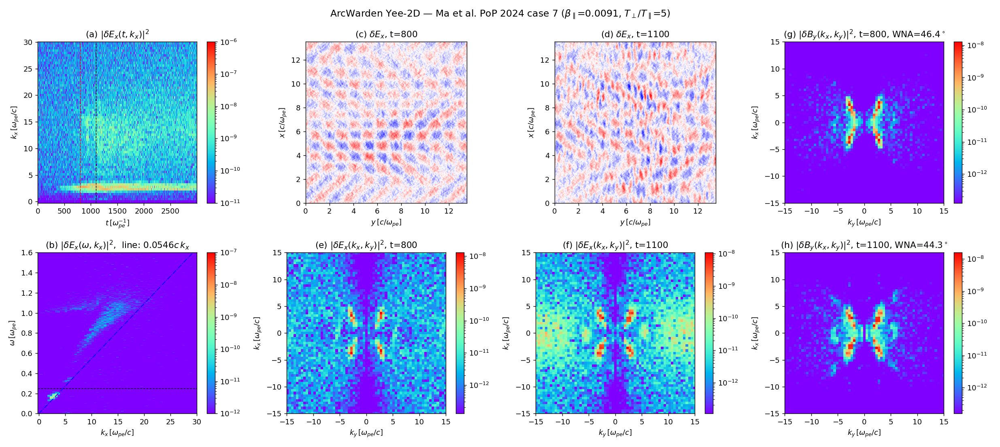
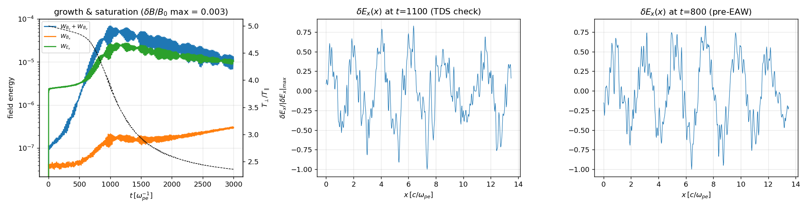

# Ma et al. (PoP 2024) case 7 — oblique whistlers + EAW/TDS on the Yee-2D branch

Reproduction of Figure 1 of Ma, An, Artemyev, Bortnik, Angelopoulos & Zhang,
*Nonlinear Landau resonant interaction between whistler waves and electrons:
Excitation of electron acoustic waves*, Phys. Plasmas **31**, 022304 (2024)
([arXiv:2308.03938](https://arxiv.org/abs/2308.03938)). Setup taken verbatim from
the OSIRIS deck `eaw_ech_search_case7` in
[donglai96/EAW_ECH_whistler](https://github.com/donglai96/EAW_ECH_whistler)
(repo case 7 = paper Table I case 8: β∥ = 0.0091, T⊥/T∥ = 5).

This is the first **true-2D** exercise of `MaxwellSimulation` (the An 2019
cross-check ran ny = 1): 2D Yee curls, 2D Esirkepov deposit, oblique-mode
competition, and 207k-step long-time energy behavior in one run.

## Setup (`decks/eaw_case7.ini`, runner `tools/eaw2d_yee.cu`)

- 625×625 cells, Lx = Ly = 13.5 c/ωpe (dx = 0.0216 = 1.29 λ_D∥), periodic
- c = 1, B0 = 0.25 ωpe x̂ (in-plane), dt = 0.0145 = 0.95 dx/(√2 c)
- single electron species, immobile neutralizing ions; noisy load, ppc = 400
- uth = (0.01678, 0.03752, 0.03752) c → T⊥/T∥ = 5, β∥ = 2(v_T∥/v_Ae)² = 0.0091
- `jfilter = 3`: 3-pass binomial (1,2,1)⊗(1,2,1)/16 current smoothing per step —
  the OSIRIS `smooth` block equivalent, added to the Yee loop for this work.
  Without it, CIC shot noise at dx > λ_D heats T∥ and eats the anisotropy.
- t_end = 3000 ωpe⁻¹ (206 897 steps); 2 h 19 m on RTX 5090 @ 3.9×10⁹ p-steps/s

Run: `./eaw2d_yee decks/eaw_case7.ini out` →
`scripts/plot_eaw_case7.py out` (Figure-1 analog + history).

## Results vs paper

| Quantity | Paper Fig. 1 | ArcWarden Yee-2D |
|---|---|---|
| Whistler onset | t ~ 300, k∥ ≈ 3.26 ωpe/c | t ~ 300, kx ≈ 2.8 |
| Saturation | t ≈ 1100 | t ≈ 1000–1100 |
| Wave normal angle | ~45° | 46.4° (t=800), 44.3° (t=1100) |
| δEx, δBy 2D spectra | 4-lobe oblique X-pattern | same X-pattern |
| Beam-mode v_ph,∥ | 0.0546 c = 3.25 v_T∥ | ω–kx ridge on the 0.0546c line |
| EAW band | k∥ = 5–20 from t ~ 1000 | 5.7× noise for t > 1000 |
| δB/B0 (t=1100) | ~0.01 (peak) | 0.0027 rms ≈ 0.008–0.01 peak |
| TDS | short-λ δEx structures at t_B | present at t=1100, absent at t=800 |

Physics sequence reproduced end-to-end: anisotropy-driven oblique whistler
growth (small-β∥ regime → oblique dominant mode) → nonlinear Landau trapping of
thermal electrons by E∥ of the oblique wave → field-aligned beams → electron
acoustic waves / time-domain structures at k∥ = 5–20 ωpe/c, while T⊥/T∥ relaxes
from 5.0 to ~2.5.

Run data preserved under `build/eaw_case7/` (2D snapshots every 50 ωpe⁻¹,
6-component lineouts every 1 ωpe⁻¹, 1M-marker phase-space subsamples every
250 ωpe⁻¹) for further figures (resonant islands, trapped beams, EAW dispersion).
