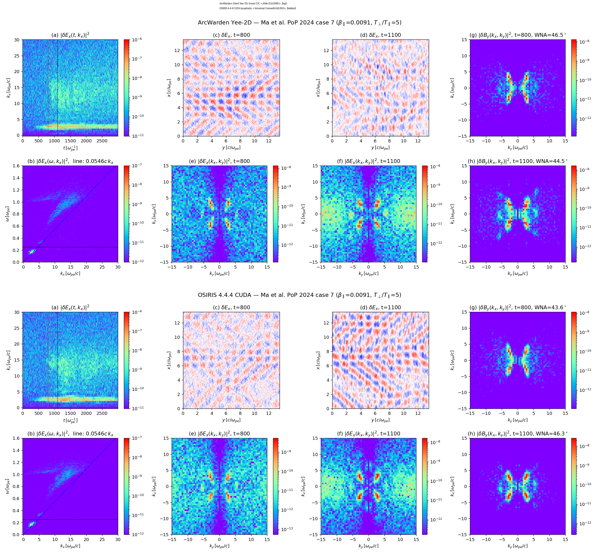
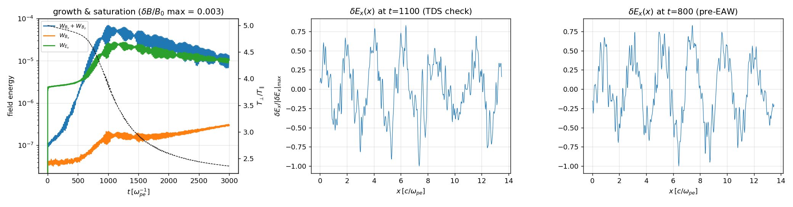
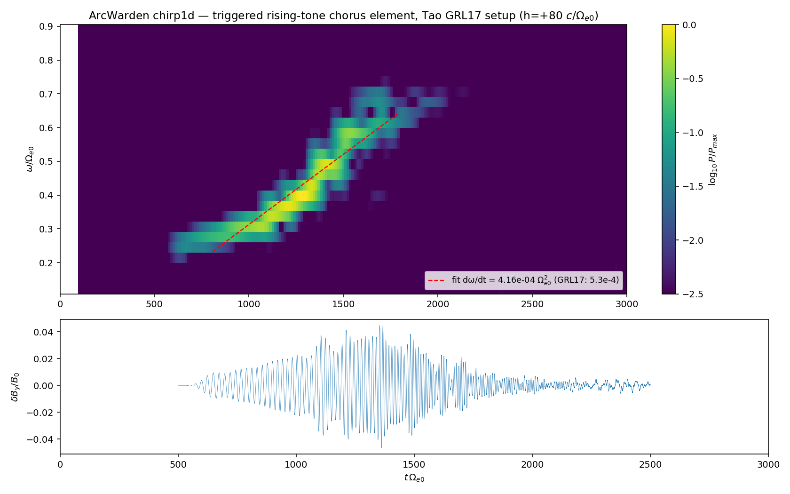
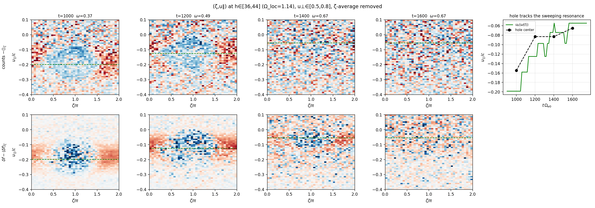
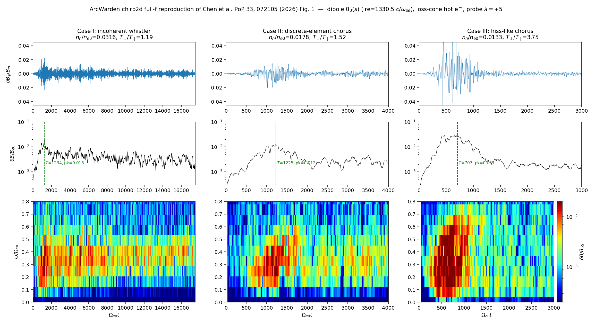
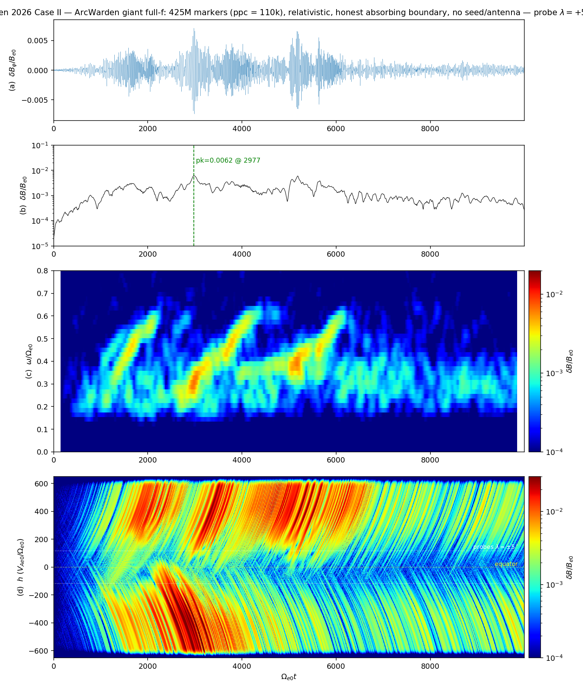

# ArcWarden — Milestone Summary

*Compiled 2026-07-25. One page per milestone: what was reproduced, the numbers, the figures.
All figures live in `docs/figs/`; decks in `decks/`; full technical logs linked per section.*

ArcWarden is a from-scratch CUDA particle-in-cell code (RTX 5090, sm_120) with three
code paths sharing one particle engine (fused gather–Boris–move–scatter kernel, tiled
deposit, amortized sort): **2D spectral Darwin** (magnetoinductive, UPIC lineage,
`darwin_tc` time-centering), **2D EM Yee/Esirkepov** (full Maxwell, charge-conserving,
2.59× faster than OSIRIS-CUDA), and a **1D gcPIC-style field-aligned chorus code**
(`chirp2d`: hot PIC + linearized cold fluid + dipole B₀(s) + mirror force, δf/full-f).
Five published results have been reproduced end-to-end:

| # | Milestone | Reference | Headline number |
|---|-----------|-----------|-----------------|
| 1 | Darwin engine: whistler-driven nonlinear trapping | An et al., PRL 122, 045101 (2019) | Sims 1/2/3 reproduced; Darwin vs Yee saturation δB/B₀ = 0.105 vs 0.108 (2.7%) |
| 2 | 2D EM engine beats OSIRIS; EAW case reproduced | Ma et al., PoP 31, 022304 (2024) | 1.55×10¹⁰ p-steps/s, **2.59× faster** than OSIRIS-CUDA, identical physics |
| 3 | 1D rising-tone chorus (chirping) | Tao et al., GRL 44 (2017) | Chirp 0.25→0.7 Ωe; ∂ω/∂t = 4.2×10⁻⁴ vs theory 5.3×10⁻⁴; hole tracked live |
| 4 | Two-band chorus with 0.5 fce gap | Li et al., Nat. Commun. 10, 4672 (2019) | gap/LB carved 1.07 → **3×10⁻⁴** over 950 τ_g (3 decades, 4 stages) |
| 5 | Discrete chorus elements, full-f | Chen et al., PoP 33, 072105 (2026) | All 3 regimes; Case II riser 0.2→0.53 Ωe, peak δB/B = 0.030 (paper: 0.027) |

---

## Milestone 1 — Darwin code reproduces An et al. 2019 (whistler-driven nonlinear wave structures)

**Reference:** An, Bortnik et al., *Unified view of nonlinear wave structures associated
with whistler-mode chorus*, PRL 122, 045101 (2019).
**Full log:** `docs/DARWIN_UPIC_COMPARISON.md`, `paper/main.tex` §5.2.

All three of An's pump-driven simulations (Table I) were run on the spectral Darwin engine
(radiation-free, ndc=2 corrector, dt = 0.2/ωpe — 6.9× coarser than the Yee light-CFL),
with the Yee branch as an independent cross-check on identical decks:

| Sim | v_r/v_th | Nonlinear structure | Reproduced |
|-----|----------|---------------------|------------|
| 1 | 3.2 | Beam-mode Langmuir waves | ✓ (`decks/an2019_sim1.ini`) |
| 2 | 2.1 | Electron-acoustic waves + unipolar double layer | ✓ (`decks/an2019_sim2.ini`) |
| 3 | 1.0 | Phase-space holes + bipolar E∥ | ✓ (`decks/an2019_sim3.ini`, 268M particles) |

Key quantitative gates (Sim 3):

- Saturation amplitude: Darwin δB/B₀ = **0.105** vs Yee **0.108** (2.7% apart), identical
  post-saturation kinetic ring-down.
- Secondary electrostatic band stays at the noise floor until δB/B₀ ≈ 0.1, then erupts
  **28× above floor** — the amplitude-threshold signature, seen in both branches.
- Cold-plasma eigenmode check: Darwin ω error 0.05%, Yee 0.03%; measured Darwin–Yee gap
  0.21% vs 0.23% analytic — the two solvers differ by exactly the physics they should.
- Phase-space hole chain sits at v_r = 1.04 v_th with matching bipolar E∥, reproducing
  An's Fig. 5 structure.

*Sim 3 cross-check: amplitude history (Darwin vs Yee), electrostatic-band threshold
eruption, and phase-space holes at saturation.*

*Darwin-branch Sim 3 at t = 1200/ωpe: bipolar δE∥ waveforms aligned to a chain of
phase-space trapping vortices at v_r ≈ 1.04 v_th (f and δf views).*

**Caveats (documented):** pump amplitude needed 5–6× scaling to reach threshold (drive
couples off the exact Darwin resonance; An et al. tuned likewise). Legacy Darwin had O(dt)
free-mode damping of self-excited modes; fixed 2026-07-23 by UPIC-style trial-push
time-centering (`darwin_tc`) — γ now dt-independent, verified against Yee (see Milestone 4).

---

## Milestone 2 — 2D EM code faster than OSIRIS; EAW case reproduced

**Reference:** Ma et al., *Nonlinear Landau resonant interaction between whistler waves and
electrons: excitation of electron acoustic waves*, Phys. Plasmas 31, 022304 (2024) — Fig. 1
(repo "case 7").
**Full log:** `docs/EAW_CASE7_REPRODUCTION.md`, `docs/PROFILE_BASELINE.md`, `paper/main.tex`.

**Physics:** 625² cells, 156.25M particles (ppc = 400), T⊥/T∥ = 5, β∥ = 0.0091, B₀ = 0.25 ωpe,
t_end = 3000/ωpe (207k steps). The full cascade is reproduced: anisotropy-driven oblique
whistler growth (onset t ≈ 300, WNA 44–47° vs paper ~45°) → nonlinear Landau trapping →
field-aligned beams (v_ph,∥ = 0.0546c ridge) → electron acoustic waves / time-domain
structures after t ≈ 1000, while T⊥/T∥ relaxes 5 → 2.5. Panel-by-panel match against
OSIRIS 4.4.4 CUDA on the same machine with matched diagnostics.

**Performance (RTX 5090, measured 2026-07-15, same deck, same diagnostics):**

| Code | Wall time | p-steps/s | Speedup |
|------|-----------|-----------|---------|
| ArcWarden Yee, tiled Esirkepov + fused migrate | **2,080 s** | **1.55×10¹⁰** | **2.59×** |
| OSIRIS 4.4.4 CUDA (quadratic + binomial-3) | 5,393 s | 6.0×10⁹ | 1× |

Ablation: flat global-atomic 4.5×10⁹ → +16×16 tile sort every 20 steps 1.51×10¹⁰ →
+fused migration 1.61×10¹⁰ p-steps/s. Microbenchmarks: tiled ρ+J deposit 14.9 Gdep/s
(6.4× vs global atomics), fused EM push 31.5 Gpush/s. The Darwin branch runs the same
case at dt = 0.1 for a **2.2× cheaper time-to-solution** than tiled Yee (5.7× vs OSIRIS).

*Head-to-head at t = 1100/ωpe: density, δEx and δBy k-spectra, and wave-normal-angle maps —
ArcWarden (top) vs OSIRIS-CUDA (bottom). Same physics, 2.59× less wall time.*

*Growth → saturation → EAW/TDS onset: δB history with anisotropy decay, and δEx lineouts
at t = 800 (no TDS) vs t = 1100 (TDS present), matching the paper's sequence.*

---

## Milestone 3 — 1D chirping chorus: Tao et al. 2017 rising tone

**Reference:** Tao et al., *Identify the nonlinear wave-particle interaction regime in
rising tone chorus generation*, GRL 44 (2017); DAWN-class 1D electron-hybrid model.
**Full log:** `docs/TAO2017_REPRODUCTION.md`.

**Setup:** 1D field-aligned Yee + linearized cold fluid + relativistic δf hot electrons,
parabolic mirror B₀(h), ωpe/Ωe = 5, w⊥/w∥ = 0.53c/0.2c, n_h/n_c = 0.6% (the paper's "6%"
is a misprint — 0.6% gives the correct element timing), triggering antenna at ω = 0.25 Ωe.
Money runs: `decks/chirping_1d_tao_trig.ini` (element) and `..._phase4.ini` (hole tracking).

Key results:

- **Rising tone 0.25 → 0.7 Ωe** (paper: 0.27 → 0.67) with subpacket envelope.
- **Chirp rate ∂ω/∂t = 4.2×10⁻⁴ Ωe²** vs Omura-theory / paper value 5.3×10⁻⁴ (21% low;
  traced to trigger amplitude 3–5× the paper's, which broadens the trapping island).
- **Phase-space hole tracked live**: (ζ, u∥) exclusion island follows the resonance
  velocity u_R(ω) as ω sweeps — the direct nonlinear-trapping signature.
- Energy closure: hot population loses 13% of its energy to the wave (δf weights rms 0.86).
- Full-f runs self-ignite from shot noise (convective amplifier); unseeded δf stays silent —
  the null test that separates amplifier physics from noise artifacts.
- The same chirp survives the move to the 2D Yee path, nonrelativistic and relativistic
  (`figs/chirp2d_first_light.png`, `figs/chirp2d_rel_closure.png`).

*Spectrogram of the triggered element with fitted chirp slope (4.16×10⁻⁴ vs GRL17
5.3×10⁻⁴ Ωe²) and the δB/B₀ packet envelope.*

*The mechanism: (ζ, v∥) phase-space hole snapshots with the u_R(ω) resonance overlay —
the hole center sweeps with the chirping frequency, as Tao's regime analysis requires.*

---

## Milestone 4 — Li et al. 2019 Nature Communications: two-band chorus + 0.5 fce gap

**Reference:** Li et al., *Origin of two-band chorus in the radiation belt of Earth*,
Nat. Commun. 10, 4672 (2019).
**Full log:** `docs/GAP_PLAN.md` (G2.1), `docs/DARWIN_UPIC_COMPARISON.md`.

**Setup:** 1D periodic box tilted 15° (Li's oblique geometry), 1024 cells, Lx = 51.2 c/ωpe,
ωpe/Ωe = 5, dt = 0.02, 1.6M steps ≈ **1018 τ_gyro**. Bi-kappa loader (`kappa_v`): 80% cold
κ = 4 + 20% warm κ = 1.5 with T⊥/T∥ = 4, velocity capped at 0.6c (the unbounded κ = 1.5
tail otherwise seeds superluminal markers — caught and gated). Yee/Esirkepov solver.

**Result — the gap is carved, in Li's four stages:**

| Window (τ_g) | Stage | gap/LB |
|--------------|-------|--------|
| 200–250 | one continuous band, fastest growth near 0.5 Ωe | 1.07 |
| 300–400 | Landau plateau rises at \|v∥\| ∈ [0.08, 0.10]c; splitting onset | 0.31 |
| 500–800 | gap deepens, upper band emerges distinct (0.55–0.65 Ωe) | 0.095 → 0.006 |
| 900–950 | saturation | **3×10⁻⁴** |

Three decades of monotonic deepening (power reduction ~3500×), saturation δB_rms/B₀ = 1.9%,
Landau plateau exactly at the Vp-extremum band — the plateau→gap engine Li proposed,
reproduced end-to-end from a kappa loader with no imposed gap anywhere.

*k–ω spectrograms early vs late (Li Fig.-4 format): the continuous whistler band splits
into lower + upper bands with the 0.5 fce notch; side panels show the f(v∥) plateau and
the three-decade gap power decay.*

*Gate summary at 800–1000 τ_g: probe spectrogram, plateau band, LB/gap/UB power history,
and the Δf(v∥, t) carving map.*

**Solver cross-check (the methods-paper lesson):** the legacy Darwin arm shows *no gap* at
dt = 0.2 or dt = 0.05 — O(dt) free-mode damping suppresses the self-excited band
(`figs/li2019_band_darwin_dt005_kw.png`). After porting UPIC's trial-push time-centering
(`darwin_tc`), Darwin at dt = 0.2 recovers the two-band + gap structure (gap/LB = 6.8×10⁻⁴,
`figs/li2019_band_darwin_tc_kw.png`) — the kinetic engine is solver-independent, and Yee is
the production solver for gap physics.

---

## Milestone 5 — Chen et al. 2026: discrete chorus regimes, full-f 1D

**Reference:** Chen et al., Phys. Plasmas 33, 072105 (2026) — Fig. 1 regime taxonomy.
**Full log:** `docs/CHEN2026_REPRODUCTION.md`.

**Setup (chirp2d runner, full-f mandatory — waves grow from shot noise, no antenna):**
1D field-aligned hot PIC + linearized cold fluid + **dipole** B₀(s) (lre = 1330.5 c/ωpe,
×10-compressed geometry), loss-cone-subtracted bi-Maxwellian (T∥ = 20 keV), relativistic,
hybrid Umeda boundary, 5000 cells over ±26.6° latitude, ppc up to 3200 (giant runs: 110k).

**All three regimes of the paper's Fig. 1 reproduced** (~35 min total on the 5090 at ppc=800):

| Case | nh/ne | A | Paper | ArcWarden |
|------|-------|-----|-------|-----------|
| I | 0.0316 | 1.19 | incoherent band ~0.2 Ωe | rising structure 0.2–0.3 Ωe ✓ regime |
| II | 0.0178 | 1.52 | single riser 0.25→0.60 Ωe, δB/B = 0.027 | riser 0.205→0.532 Ωe, δB/B = **0.030** ✓ |
| III | 0.0133 | 3.75 | packed risers 0.15–0.6 Ωe, δB/B = 0.038 | broadband flood 0.15–0.6 Ωe, δB/B = **0.038** ✓ |

A δf twin with a partially-reflecting boundary reproduces the paper's *timeline* too
(element at t ≈ 7000/Ωe, peak 0.0263 — `figs/chen2026_df_timeline.png`), a
method-independence proof that also identified the paper's undocumented wave-reflecting
boundary as the timing ingredient.

**Beyond the paper — the lre 3-point scan** (Case II at ×20/×10/×5 dipole compression)
closed the theory matrix: threshold ∝ lre⁻⁴ (×20 suppressed: B_th > B_opt, box stays at
noise floor; ×10 threshold-gated discrete shots; ×5 refill-gated element complexes with
period ∝ T_b), and the sweep rate is **0.72–0.73× Omura Eq. 88 at both lre** —
amplitude-controlled and lre-free, exactly the nonlinear-chirp scaling.

*Fig.-1-format comparison across Cases I/II/III (full-f, ppc = 3200): the
nh/ne–anisotropy regime taxonomy — incoherent band / discrete elements / hiss-like flood.*

*Case II at ppc = 110k: quiet linear phase (γ = 2.6×10⁻³), then repetitive discrete rising
tones 0.2→0.6 Ωe with subpackets — the two-clock (threshold + refill) relaxation
oscillator resolved above the noise floor.*

---

## Where this leaves the code

Two validated field engines (Yee production, Darwin-tc cross-check) + one validated
particle engine, spanning: periodic anisotropy-driven instabilities (M1, M4), 2D oblique
EM turbulence at OSIRIS-beating speed (M2), and bounded-flux-tube self-consistent chorus
with mirror geometry (M3, M5). Current flagship (task #21): the RSM oblique-harmonic
bridge model — chirping (M5 physics) + 0.5 fce gap (M4 physics) in one full-f box
(`docs/RSM_MODEL_DEFINITION.md`).
