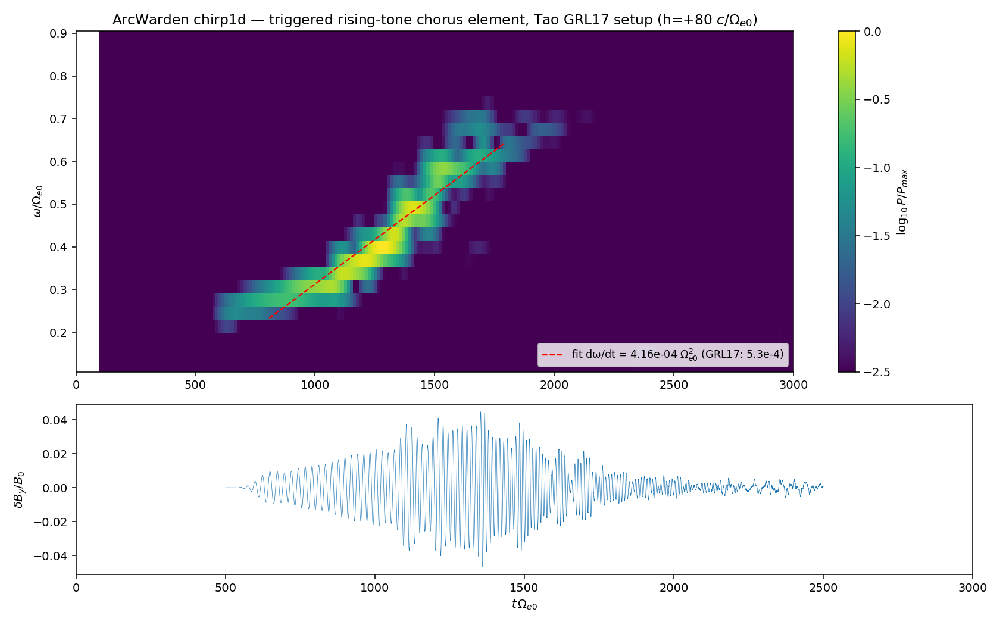
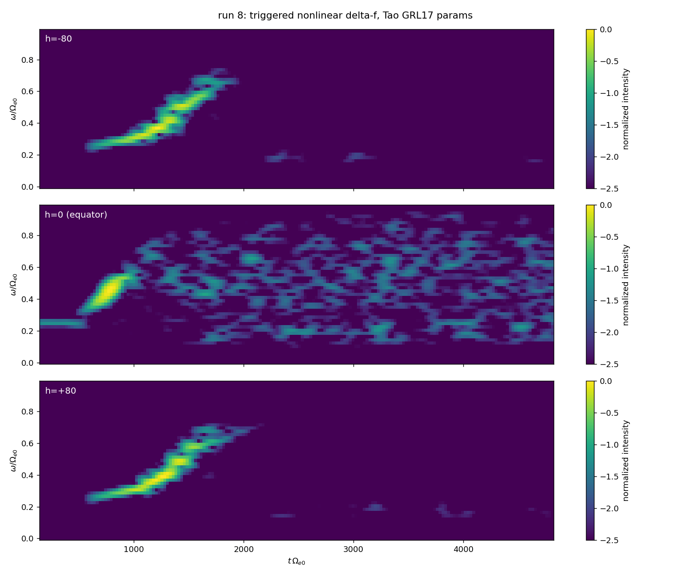
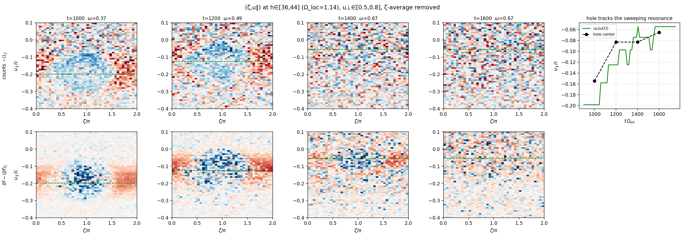

# Reproduction of Tao, Zonca & Chen (GRL 2017): rising-tone chorus in 1D

**Status: reproduced** (2026-07-13). ArcWarden's `chirp1d` — the 1D field-aligned
electron-hybrid module (`include/pic/hybrid1d.hpp`, L-shell plan M4-gate vehicle) —
reproduces the rising-tone chorus element, its chirp rate, its subpacket
structure, and the resonant electron phase-space hole of

> X. Tao, F. Zonca, L. Chen, *Identify the nonlinear wave-particle interaction
> regime in rising tone chorus generation*, GRL 44, 3441 (2017),
> doi:10.1002/2017GL072624 — and its companion X. Tao et al., PPCF 59, 094001
> (2017) which documents the DAWN nonlinear δf method and the triggered setup.

ArcWarden `chirp1d` is architecturally the same model class as DAWN
(Katoh-Omura electron hybrid): 1D staggered-grid transverse Maxwell + linearized
cold electron fluid + relativistic PIC hot electrons with the adiabatic mirror
force of `B0(h) = B0(1 + a h²)`, particle reflection + Umeda masked field
damping, plain bi-Maxwellian hot electrons, nonlinear δf option, equatorial
triggering antenna. Units: Ω_e0 = c = 1.

## Run recipe

```
./chirp1d decks/chirping_1d_tao_trig.ini out          # element + spectrogram run
./chirp1d decks/chirping_1d_tao_phase4.ini out        # T=2000, dense phase dumps
python3 scripts/plot_chirp1d.py out/chirping_1d_tao_trig
python3 scripts/plot_chirp1d_tao_phase.py out/chirping_1d_tao_phase4 --hband 15,60
python3 scripts/plot_chirp1d_hole_tracking.py out/chirping_1d_tao_phase4
```

Setup (GRL17 §2, "other technical parameters as Tao et al. 2014"):
ω_pe/Ω_e0 = 5, ξ = 8.62×10⁻⁵ (Ω_e0/c)², domain ±163.85 c/Ω_e0 (6554 cells,
Δh = 0.05), Δt = 0.02, w_t∥ = 0.2c, w_t⊥ = 0.53c (T⊥/T∥ ≈ 7),
n_h/n_c = 0.6 %, reflecting particles, 15 c/Ω_e0 masking regions, nonlinear δf
(4096 ppc), R-polarized triggering current at the equator: ω₀ = 0.25 Ω_e0,
radiated δB/B0 ≈ 10⁻³, on t = 50–550 (tanh ramps).

## Results vs the paper

| quantity | GRL17 | chirp1d (run 8) |
|---|---|---|
| element band | 0.27 → 0.67 Ω_e0 | 0.25 → 0.7 Ω_e0 |
| element window | t ≈ 1133–1886 | t ≈ 600–2000 |
| chirp rate ∂ω/∂t | 5.3×10⁻⁴ Ω_e0² | 4.2×10⁻⁴ Ω_e0² (ridge fit, h=+80) |
| subpackets | period 92–130 Ω_e0⁻¹ | visible quasi-periodic envelope modulation |
| phase-space hole | (ζ,v∥) hole at v_R, v⊥≈0.65c | hole at ζ≈π, u∥≈−0.15→−0.065c |
| hole follows resonance | v_R sweeps with ω(t) | hole center tracks u_R(ω(t)) within island width |
| energy flow | resonant particles → wave | W_hot(δf) = −0.43 (13 % of hot energy) |





## Findings the reproduction surfaced

1. **The paper's "density is 6% of cold electrons" is a misprint.** With 6 %
   (γ_lin ≈ 4×10⁻²) the whole band detonates by t ≈ 800 and quenches — wrong
   element timing (deck `chirping_1d_tao6.ini`). With 0.6 % (γ_lin = 1.3×10⁻²)
   the nonlinear stage lands exactly in the published window. Wu et al. (GRL
   2020, same group) also state 0.6 %.
2. **Full-f reproduces the *noisy* version.** A spontaneous full-f run at 0.6 %
   (`chirping_1d_tao.ini`) gives wave packets buried in shot noise — matching
   the full-f panels of PPCF17 Fig. 2. The clean published element needs the
   nonlinear δf method (noise ↓ by (f/δf)²).
3. **The bounded field line is a convective amplifier, not an oscillator.**
   Full-f ignites spontaneously because shot noise continuously re-seeds the
   amplifier; δf has zero spontaneous emission, so an unseeded δf run stays
   silent forever (`chirping_1d_tao_df.ini` null test) — hence the triggering
   antenna in the δf papers.
4. **δf weights become O(1) during the element** (rms w ≈ 0.86; the hot
   population loses 13 % of its energy). The nonlinear (1−w) form stays valid,
   but ζ-averaged quasilinear relaxation then dominates raw δf histograms; the
   trapped-island hole is isolated by removing the ζ-average at each u∥
   (`plot_chirp1d_hole_tracking.py`). This is the plan's risk R1 observed live.
5. Our element amplitude (δB/B0 ≈ 0.05 at h = 40) runs ~3–5× the paper's,
   presumably an un-tuned trigger; a weaker trigger would thin the trapping
   island (Δu∥ = 2ω_tr/k) and sharpen the hole. Mechanism unaffected.

## Validation ladder under this result (all in ctest)

single-particle mirror bounce & μ conservation → cold whistler dispersion →
kinetic anisotropy growth rate vs `scripts/whistler_kinetic_dispersion.py`
(Z-function solver) → full-f vs δf growth-rate consistency → this element.
